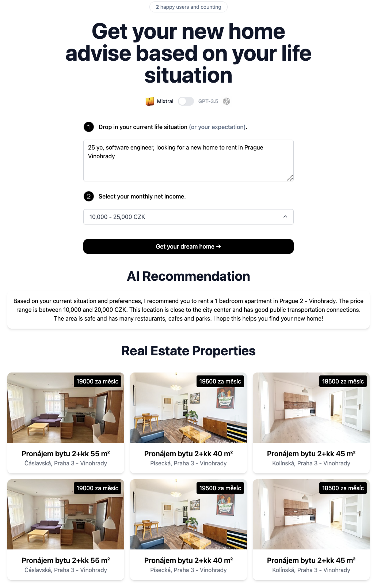

# [AI Home Advisor](https://www.home-ai-advisor.vercel.com/)

This project uses AI to generate personalized real estate recommendations based on your life situation and income. The real estate data is sourced from the Czech Republic site [sreality.cz](https://www.sreality.cz/). The data is stored in a MongoDB database, populated by a scraper available on [GitHub](https://github.com/karlosmatos/sreality-scraper).

## How it works

AI Home Advisor uses both [Mixtral](https://mistral.ai/news/mixtral-of-experts/) and [GPT-3.5](https://openai.com/api/) with FastAPI in backend to generate real estate recommendations. It constructs a prompt based on the form and user input, sends it either to the Mixtral API through [Groq](https://www.groq.com/) or the GPT-3.5 API through OpenAI, then based on AI response it filters the real estate data from the MongoDB database and returns the filtered data to the user.

## Running Locally

1. Clone the repository with `git clone https://github.com/karlosmatos/home-ai-advisor.git`.
2. Copy the `.env.example` file to `.env`.
1. Create an account at [OpenAI](https://beta.openai.com/account/api-keys) and add your API key under `OPENAI_API_KEY` in your `.env`
2. Create an account at [Groq.com](https://www.groq.com/) and add your API key under `GROQ_API_KEY` in your `.env`
3. Create a MongoDB database and add the URI under `MONGO_URI` in your `.env`
4. Add the database name under `MONGO_DB` in your `.env`
5. Add the collection name under `MONGO_COLLECTION` in your `.env`
6. Add the base URL of the API under `NEXT_PUBLIC_API_BASE_URL` in your `.env`. If you are running the application locally, it should be `http://localhost:8000`.
8. Run the scraper to populate the database based on scraper instructions on [GitHub](https://github.com/karlosmatos/sreality-scraper/blob/main/README.md).
7. Install the dependencies with `npm install`.
9. Run the application with `npm run dev` and it will be available at `http://localhost:3000`. API will be available at `http://localhost:8000/api/docs`.

## One-Click Deploy

Deploy the example using [Vercel](https://vercel.com?utm_source=github&utm_medium=readme&utm_campaign=vercel-examples):

